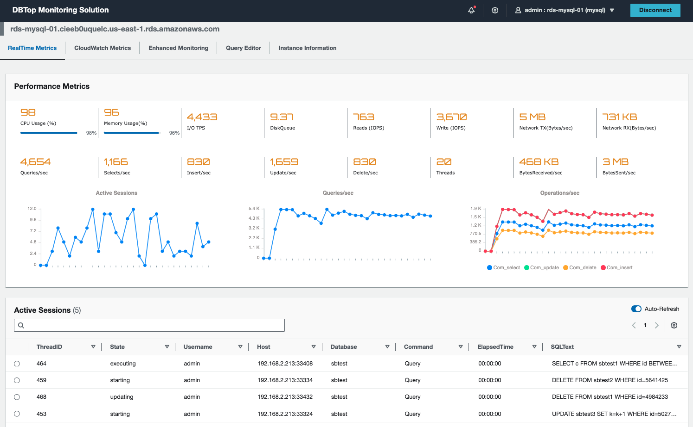
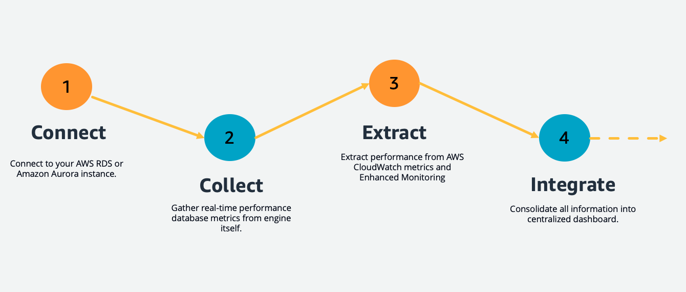

# DBTop Monitoring Solution for AWS Database Services

> **Disclaimer:** The sample code; software libraries; command line tools; proofs of concept; templates; or other related technology (including any of the foregoing that are provided by our personnel) is provided to you as AWS Content under the AWS Customer Agreement, or the relevant written agreement between you and AWS (whichever applies). You are responsible for testing, securing, and optimizing the AWS Content, such as sample code, as appropriate for production grade use based on your specific quality control practices and standards. Deploying AWS Content may incur AWS charges for creating or using AWS chargeable resources, such as running Amazon EC2 instances, using Amazon CloudWatch or Amazon Cognito.


## What is DBTop Monitoring ?

DBTop Monitoring is evolution of [RDSTop Monitoring Solution](https://github.com/aws-samples/rds-top-monitoring) initiative.

DBTop Monitoring is lightweight application to perform realtime monitoring for AWS Database Resources. 
Based on same simplicity concept of Unix top utility, provide quick and fast view of database performance, just all in one screen.


## How looks like DBTop Monitoring ?





## How it works?




## Database engine support

DBTop Monitoring Solution currently supports following database engines:

- AWS RDS for MySQL
- AWS RDS for PostgreSQL
- AWS RDS for MariaDB
- AWS RDS for Oracle
- AWS RDS for SQLServer
- Amazon Aurora Instance (MySQL-Compatible Edition)
- Amazon Aurora Instance (PostgreSQL-Compatible Edition)
- Amazon ElastiCache for Redis
- Amazon MemoryDB for Redis
- Amazon Aurora Clusters (MySQL-Compatible Edition)
- Amazon Aurora Clusters (PostgreSQL-Compatible Edition)
- Amazon DocumentDB Clusters

Additional expanded support coming later to :

- Amazon OpenSearch Service


## Solution Components

- **Frontend.** React Developed Application to provide user interface to visualize performance database information.

- **Backend.** NodeJS API Component to gather performance information from database engines, AWS CloudWatch and Enhanced Monitoring.


## Architecture


## Use cases

- **Monitor instance performance.**
    Visualize performance data on realtime, and correlate data to understand and resolve the root cause of performance issues in your database instances.

- **Perform root cause analysis.**
    Analyze database and operating system metrics to speed up debugging and reduce overall mean time to resolution.

- **Optimize resources proactively.**
    Identify top consumer sessions, gather SQL statements and resource usages.


## Solution Requirements

#### Amazon RDS Enhanced Monitoring

Amazon RDS provides metrics in real time for the operating system (OS) that your DB instance runs on. DBTop Monitoring solution integrate metrics from Enhanced Monitoring and it has to be enabled. 
Follow procedure below to turn on Enhanced Monitoring.

https://docs.aws.amazon.com/AmazonRDS/latest/UserGuide/USER_Monitoring.OS.Enabling.html


#### VPC Network Access to AWS Database Instances

DBTop Monitoring Solution needs to access privately AWS Database resources, grant inboud access for security groups used by database resources.


## Resource Usage and Cost

DBTop Monitoring Solution will use following resources:

- **AWS EC2 instance.**
     The cost of this resource will depend of size selected during the deployment process. AWS EC2 instance pricing can be review [here](https://aws.amazon.com/ec2/pricing/).

- **AWS CloudWatch API Calls.** 
    The cost of this resource will depend how much time the application is being used and modules as well. 
    DBTop Monitoring Solution uses data extracted from DBEngine itself and only extract information on demand from AWS CloudWatch (GetMetricData API) in case the module is selected.
    AWS CloudWatch API Calls pricing can be review [here](https://aws.amazon.com/cloudwatch/pricing/).

    

## Solution Deployment


> **Time to deploy:** Approximately 10 minutes.


### Create database monitoring users

Database credentials are needed to connect to the database engine and gather real-time metrics, use following statements to create the monitoring users.

#### MySQL
```
CREATE USER 'monitor'@'%' IDENTIFIED BY '<PASSWORD>';
GRANT PROCESS ON *.* TO 'monitor'@'%' ;
```

#### PostgreSQL
```
CREATE USER monitor WITH PASSWORD '<PASSWORD>';
GRANT pg_read_all_stats TO monitor;
```

#### MS SQLServer
```
USE [master]
GO
CREATE LOGIN [monitor] WITH PASSWORD=N'<PASSWORD>', DEFAULT_DATABASE=[master], CHECK_EXPIRATION=ON, CHECK_POLICY=ON
GO
use [master]
GO
GRANT CONNECT SQL TO [monitor]
GO
GRANT VIEW SERVER STATE TO [monitor]
GO
```

#### Oracle
```
CREATE USER monitor IDENTIFIED BY '<PASSWORD>';
GRANT CREATE SESSION,SELECT ANY DICTIONARY TO monitor;
```


#### Amazon DocumentDB
```
db.createUser(
{
    user: "monitor",
    pwd: "<PASSWORD>",
    roles: [ "clusterMonitor" ]
}
)
```

### Launch CloudFormation Stack

Follow the step-by-step instructions to configure and deploy the DBTop Monitoring Solution into your account.

1. Make sure you have sign in AWS Console already.
2. Download AWS Cloudformation Template (DBMonitoringSolution.template) located into conf folder.
3. [**Open AWS CloudFormation Console**](https://console.aws.amazon.com/cloudformation/home#/stacks/create/template?stackName=DBTopMonitoringSolution)
4. Create an stack using Cloudformation template (DBMonitoringSolution.template) already downloaded on step 2.
5. Input **Stack name** parameter. 
6. Acknowledge **Application Updates - Disclaimer** parameter.
7. Input **Username** parameter, this username will be used to access the application. An email will be sent with temporary password from AWS Cognito Service. 
8. Input **AWS Linux AMI** parameter, this parameter specify AWS AMI to build App EC2 Server. Keep default value.
9. Select **Instance Type** parameter, indicate what instance size is needed.
10. Select **VPC Name** parameter, indicate VPC to be used to deploy application server.
11. Select **Subnet Name** parameter, indicate subnet to be used to deploy application server, this subnet needs to have outbound internet access to reach AWS APIs. Also application server needs to be able to reach AWS Database Resources, add appropiate inboud rules on AWS RDS security groups to allow network connections.
12. Select **Public IP Address** parameter, the deployment will assign private IP Address by default to access the application, you can assign Public IP Address to access the application in case you need it, Select (true) to assign Public IP Address.
13. Input **CIDR** parameter, specify CIDR inbound access rule, this will grant network access for the application.
14. Click **Next**, Click **Next**, select **acknowledge that AWS CloudFormation might create IAM resources with custom names**. and Click **Submit**.
15. Once Cloudformation has been deployed, gather application URL from output stack section. Username will be same you introduce on step 7 and temporary password will be sent by AWS Cognito Service.
16. Application deployment will take around 5 minutes to be completed.

> **Note:** Because you are connecting to a site with a self-signed, untrusted host certificate, your browser may display a series of security warnings. 
Override the warnings and proceed to the site. To prevent site visitors from encountering warning screens, you must obtain a trusted, 
CA-signed certificate that not only encrypts, but also publicly authenticates you as the owner of the site.


